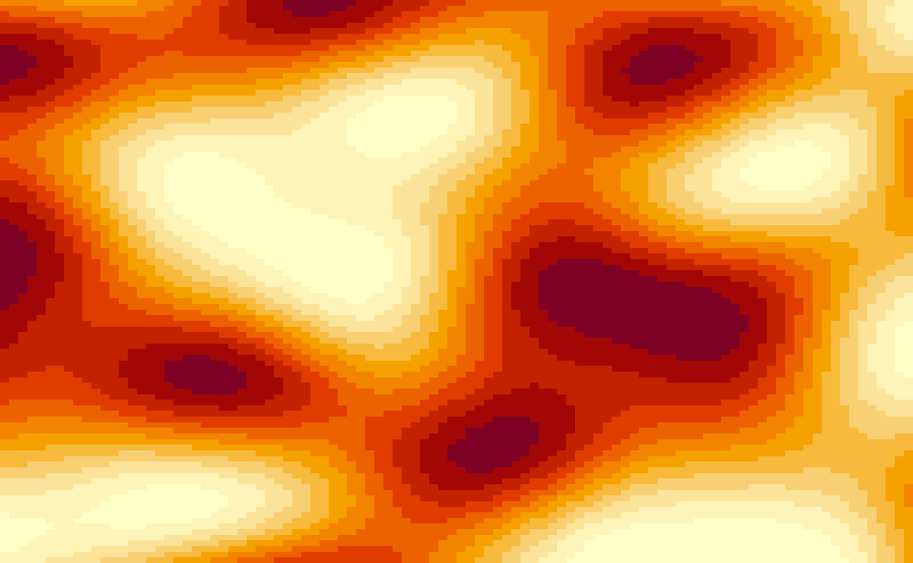
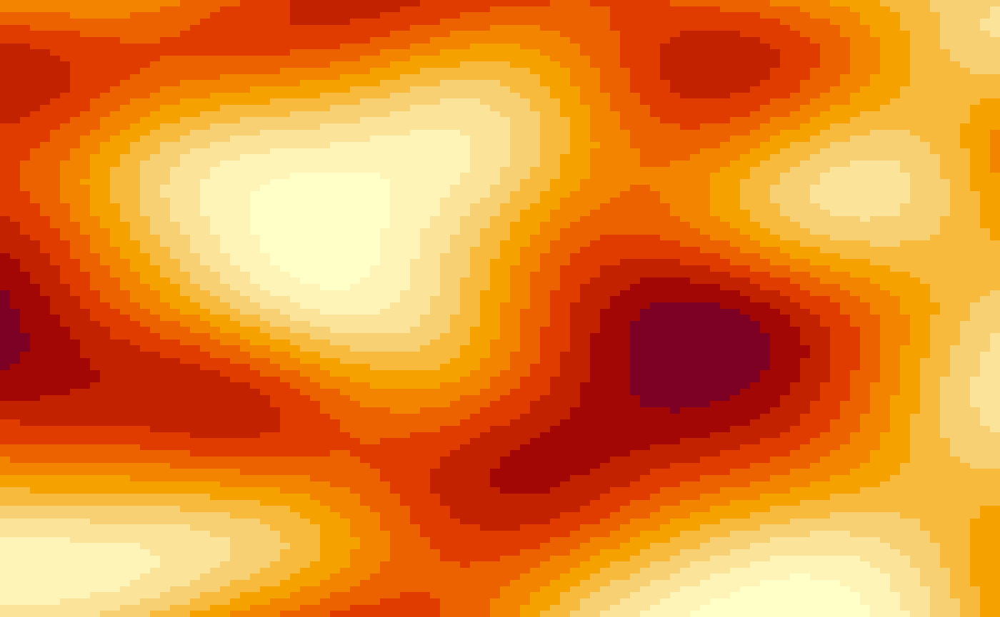
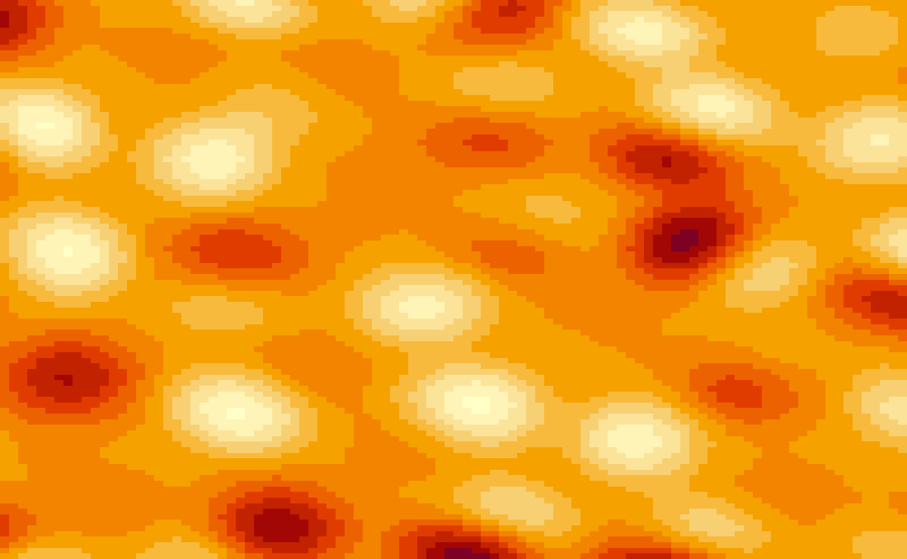

# N-Dimensional Noise

TODO

``` r
library(opensimplex2)
image(opensimplex_noise("F", 100, 100, frequency = 2),
      axes = FALSE, ann = FALSE, xaxs = "i", yaxs = "i")
```



``` r
set.seed(0)
image(opensimplex_noise("S", 100, 100, frequency = 2),
      axes = FALSE, ann = FALSE, xaxs = "i", yaxs = "i")
```



## Infinite Loop

``` r
scale_factor <- 50
space        <- opensimplex_space("L", 4L)
coords       <- expand.grid(z = 1:100, t = 1:100, frame = 1:100)
coords$x     <- 100*sin((2*pi*coords$frame - 1)/100)
coords$y     <- 100*cos((2*pi*coords$frame - 1)/100)
coords$value <- space$sample(.1*coords$x/scale_factor,
                             .1*coords$y/scale_factor,
                             2*coords$z/scale_factor,
                             2*coords$t/scale_factor)

for (i in 1:100) {
  frame_data <- subset(coords, frame == i)
  mat <- matrix(frame_data$value, 100, 100)
  image(mat,
        axes = FALSE, ann = FALSE, xaxs = "i", yaxs = "i",
        zlim = c(-1, +1))
}
```


