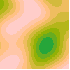
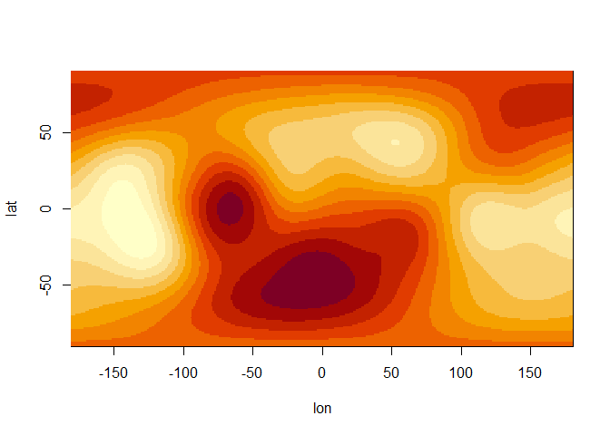

# opensimplex2 [](https://pepijn-devries.github.io)

This package provides a high-performance implementation of OpenSimplex2,
the successor to the original OpenSimplex noise. It is designed to
produce smooth, organic-looking procedural content with fewer
directional artefacts (streaking) than traditional Perlin noise.

## Installation

This package is currently experimental and can only be installed from
GitHub:

``` r
remotes::install_github("pepijn-devries/opensimplex2")
```

## Example

This library offers two primary methods for generating noise:

### N-Dimensional Noise Arrays

Generate a complete grid of noise values in a single call. This is ideal
for pre-computing textures, terrain heightmaps, or static displacement
maps. There are two variants available:

- OpenSimplex2F (Faster): Optimized for speed, providing a classic
  OpenSimplex look.
- OpenSimplex2S (Smoother): A “SuperSimplex” variant that prioritizes
  higher visual quality and reduced grid-alignment artefacts at a slight
  performance cost.

``` r
library(opensimplex2)
## Set seed to obtain reproducible data
set.seed(0)
## Create simplex noise in 3 dimensions:
arr <- opensimplex_noise("S", 100, 100, 100, frequency = 1.5)

## Plot 2D noise while looping the third dimension:
for (i in 1:100) {
  image(arr[,,i],
        axes = FALSE, ann = FALSE, xaxs = "i", yaxs = "i",
        zlim = c(-1, +1), col = hcl.colors(palette = "Terrain", 10))
}
```



### Continuous Gradient Fields

Beyond static arrays, the library provides a sampleable gradient field.
Instead of just returning a single noise value, this allows you to query
the vector gradient at any precise n-dimensional coordinate.

``` r
## Let's create a raster of polar coordinate:
r <- .5
lon <- seq(-180, 180)
lat <- seq(-90, 90)
coords <-
  expand.grid(
    lon = lon,
    lat = lat)
## Now convert the polar coordinates to Cartesian coordinates:
coords$x <- r*cos(pi*2*coords$lat/360)*sin(pi*2*coords$lon/360)
coords$y <- r*cos(pi*2*coords$lat/360)*cos(pi*2*coords$lon/360)
coords$z <- r*sin(pi*2*coords$lat/360)

## Set seed to make the example reproducible:
set.seed(0)

## Let's create a noise gradient 3-dimensional space:
space <- opensimplex_space("S", 3L)

## Sample the space at the coordinates on the sphere:
coords$value <- space$sample(coords$x, coords$y, coords$z)

## Plot the sampled matrix:
mat <- matrix(coords$value, length(lon), length(lat))
image(x= lon, y = lat, z = mat)
```



Unlike an array, the field is mathematically continuous. You can sample
at any scale or offset without losing precision. This is useful for
physics simulations (like flow fields or wind), surface normals for
lighting, or calculating the “slope” of procedural terrain for erosion
and placement logic.

## Acknowledgements

This package wraps the C-code by [Marco
Ciaramella](https://github.com/MarcoCiaramella/opensimplex2), which in
turn is a translation of the original Java code by
[KdotJPG](https://github.com/KdotJPG/OpenSimplex2).

## Code of Conduct

Please note that the opensimplex2 project is released with a
[Contributor Code of
Conduct](https://contributor-covenant.org/version/2/1/CODE_OF_CONDUCT.html).
By contributing to this project, you agree to abide by its terms.
